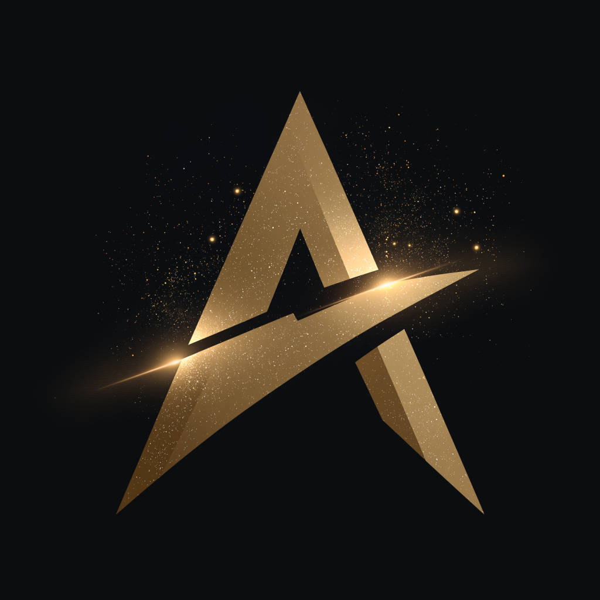

Companies pivot or vanish, links rot, and what remains is often incomplete, stripped of context, or locked behind
whatever proprietary wall still happens to be standing—this is the ordinary condition of the present network, the quiet
digital dark age we all already inhabit. Yet it does not have to continue. The data itself can carry enough integrity,
provenance, and structure that it survives the death of any particular host; independent nodes can hold the same
objects, verify them, and keep serving them without needing permission from a single authority. When one system
disappears, the data does not disappear with it. Movement across the network stops being a risk and becomes a form of
reinforcement.

With that in mind, I created the [TEK Federation](https://tekfed.org) — an umbrella organization the provides
supporting infrastructure for open projects, initiatives, and new ideas. To learn more, read the articles I published,
that are the bedrock of my current work and thinking:

* [**The Digital Dark Age**](https://tekfed.org/the_digital_dark_age.html)
* [**A Digital Golden Age**](https://tekfed.org/a_digital_golden_age.html)

